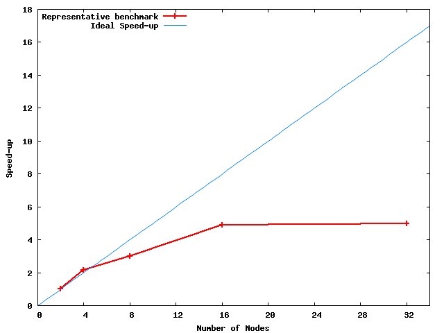

# Example Performance Report

We provide an example of perfomance report for the Production Project Submission, 
which might be used as a guideline to run the representative benchmarks, scaling test and performance analysis.

The example is a small benchmark of the [CP2K](www.cp2k.org) software package, simulating the dynamics of a 
water box featuring 256 molecules: basis set, input file, potential and SLURM submission script 
can be retrieved downloading the [compressed tarball](benchmark.tar.gz):
```text
Input files:
 GTH_BASIS_SETS
 H2O-256.inp
 POTENTIAL

SLURM batch script:
 cp2k.sbatch
```

The job runs with the SLURM constraint `gpu` on the Cray XC50, with 1 MPI task per node and 12 OpenMP threads. 
The script will write the output in `$SLURM_JOB_ID.out` and will append the wall time of each job
to the log file `$SLURM_JOB_NAME.log`, which will be useful to create the scaling plot and the table.

## Scaling

Due to the small size of the example, we can start the scaling test on 2 nodes: we will use the corresponding 
wall time as a reference to compute the speed-up of larger job sizes. 
We then proceed submitting the larger scaling jobs doubling the number of nodes each time, checking the corresponding speed-up 
until we are sure that we have reached the ∼50% limit in parallel efficiency, which occurs at 16 nodes in this small example.

The log file saved by the template SLURM batch script after 5 jobs on 2, 4, 8, 16 and 32 nodes will look like the following:
```text
daint 2017-03-28T11:53:55 1227132 	 Time=1022.373
daint 2017-03-28T10:40:12 1225749 	 Time=476.175
daint 2017-03-28T10:55:23 1225965 	 Time=339.370
daint 2017-03-28T11:01:58 1226149 	 Time=209.510
daint 2017-03-28T11:20:48 1226554 	 Time=206.249
```
The columns show the `$SLURM_CLUSTER_NAME`, the submit time, the `$SLURM_JOB_ID` and the wall time in seconds, measured 
by the application itself and printed in the output file `slurm-$SLURM_JOB_ID.out`. We present the scaling data in the table below:

Nodes | Wall time (s) | Speed-up
 ---: | ---: | ---:
    2 | 1022 | 1.00
    4 |  476 | 2.15
    8 |  339 | 3.01
   16 |  210 | 4.87
   32 |  206 | 4.96

[Strong scaling results](scaling.pdf) can be plotted against ideal scaling with this Gnuplot script (`scaling.gp`):
```gnuplot
set terminal postscript eps enhanced color size 5.5,3.5
set output "scaling.eps"
set xlabel "Number of Nodes"
set ylabel "Speed-up"
set key left
set size 1.,1.
plot "-" w linespoints linewidth 2 title "H_{2}O benchmark", x/2 w lines lt 3 title "Ideal Speed-up"
 2 1.00 
 4 2.15
 8 3.01
16 4.87 
32 4.96
```
The command `gnuplot < scaling.gp` will create an encapsulated postscript output file with the following scaling plot:


## Performance Analysis

We will now run the executable of CP2K instrumented with CrayPAT on the optimal job size of 16 nodes determined above: the results will be the report text file with extension `.rpt`, and the larger apprentice binary file with extension `.ap2`.
Since CP2K is in the list of [CSCS supported applications](/scientific_computing/supported_applications), the corresponding EasyBuild configuration file should already be available to build the corresponding module with the instrumented executable.
Therefore we follow the instructions of the [EasyBuild framework](/scientific_computing/code_compilation/easybuild_framework) and build CP2K with the `pat` suffix:
```bash
module load daint-gpu 
module load EasyBuild-custom
eb -S CP2K*pat
eb CP2K-4.1-CrayGNU-2016.11-cuda-8.0.54-pat-645-cuda.eb -r
```
After the build, the module `CP2K/4.1-CrayGNU-2016.11-cuda-8.0.54-pat-645-cuda` will be in our `MODULEPATH`: we can therefore change the module command in the SLURM batch script to load this module instead of the default CP2K modulefile:
```bash
module load daint-gpu
module load CP2K/4.1-CrayGNU-2016.11-cuda-8.0.54-pat-645-cuda
export PAT_RT_CALLSTACK=10
```
The environment variable `PAT_RT_CALLSTACK` limits the number of callers recorded by CrayPAT during the performance analysis. 
A value of zero disables all callstack tracing: please check `pat_help` after loading the perftools module for more details.
In this case, a value of 10 will give us a wall time almost ten times larger with respect to our benchmark:
```text
# perftools-cscs/645-cuda using 16 nodes
daint 2017-03-28T15:15:52 1231599 	 Time=2077.973
```
Therefore we will point out this large overhead in the resource request and we will use the value of our benchmark to justify the request. The two report files have been created in the working folder at the end of the performance analysis job:
```text
-rw-r--r-- 1 lucamar csstaff  43M Mar 28 15:51 cp2k.psmp+16437-2294t.ap2
-rw-r--r-- 1 lucamar csstaff  11K Mar 28 15:51 cp2k.psmp+16437-2294t.rpt
```
Given the relatively large size of the binary file `.ap2`, we will make them available for inspection by the reviewers in `$HOME` or `$PROJECT` (not `$SCRATCH`). The required summary data to be reported in the proposal can be extracted with the commands:
```bash
grep -A 14 CrayPat/X <report>.rpt
grep \|USER <report>.rpt
grep \|MPI <report>.rpt
```
The summary should look like the example below:
```text
CrayPat/X:  Version 6.4.5 Revision 87dd5b8  01/23/17 15:37:24
Experiment:                   lite  lite/gpu     
Number of PEs (MPI ranks):      16
Numbers of PEs per Node:         1  PE on each of  16  Nodes
Numbers of Threads per PE:   1,114
Number of Cores per Socket:     12
Execution start time:  Tue Mar 28 15:15:55 2017
System name and speed:  nid02294  2601 MHz (approx)
Intel haswell CPU  Family:  6  Model: 63  Stepping:  2

Avg Process Time:     2,100 secs             
High Memory:       13,977.3 MBytes     873.6 MBytes per PE
I/O Read Rate:    67.110363 MBytes/sec       
I/O Write Rate:   19.512511 MBytes/sec

|  59.2% | 1,236.266484 | 110.728787 |  8.8% |          1.0 |USER

|  31.8% |   664.415775 |         -- |    -- |     35,648.0 |MPI_SYNC
|   2.8% |    58.511390 |         -- |    -- | 14,458,788.1 |MPI
```
Please check the complete [example performance report file](example_performance_report_file.html) produced by CrayPAT.

## Resource Justification

The resource request of the annual amount of node-hours should be clearly linked with the node-hours used by the representative benchmark: the number of node-hours consumed by a simulation is computed multiplying the number of nodes by the wall time expressed in hours.
In this small example CrayPAT adds a non negligible overhead to the wall time, that we report within this section and then use the wall time of our scaling test to justify the request. The optimal job size of the representative benchmark is 16 nodes and the corresponding wall time reported is 210 s, which correspond ∼ 0.933 node-hours, as a result of the multiplication `16 nodes × 210s / 3600s/hour`. 
The benchmark is short and corresponds in general to a small number of iterations, while in a real production simulation we will need to extend it to several iterations, that might correspond to timesteps or an equivalent measure.

| First task | Second task
                ---: | ---: | ---:
Simulations per task | 2    | 4
Iterations per simulation | 5000 | 10000
node-hours per iteration | 0.933 | 0.933
Total node-hours | 9333 | 37333

The resource request reported in the table above will sum up to a total of 46666 annual node-hours, resulting from the sum of the node-hours estimated to complete the first and the second task of the project.
You should insert in this section the request for long term storage as well, explaining your needs based on the I/O pattern of the representative benchmark that is reported in the performance analysis.
